**Versão:** 1.0  
**Data:** 15/12/2025  
**Perfis atendidos neste manual:** Candidato, Administrador Geral, Presidente da Banca, Avaliador

---

## Para quem é este manual

Este manual foi escrito para orientar **pessoas sem familiaridade técnica** a usar o Sistema PLANTERR.

- Se você vai **se inscrever**, leia a **PARTE 1 — Candidato**.
- Se você faz parte da **equipe (Admin/Presidente/Avaliador)**, leia a **PARTE 2 — Área restrita**.
- Se apareceu alguma dúvida ou erro, consulte a **PARTE 3 — Dúvidas e suporte**.

## 1. Visão geral do sistema

O **Sistema PLANTERR** apoia o processo de seleção de anteprojetos, com:

- **Candidato**: preenche o formulário, envia a inscrição e gera um PDF com **Protocolo** e **Hash**.
- **Administrador Geral**: acompanha inscrições, consulta detalhes, exporta CSV, gerencia credenciais e executa ações administrativas.
- **Presidente da Banca**: consolida avaliações (inclusive a “Comissão”), acompanha ranking/resultados e emite relatórios.
- **Avaliador**: acessa sua área, lista projetos atribuídos e registra notas.

---

## 2. Como usar este manual (imagens e destaque visual)

Este manual usa figuras para ilustrar as telas. As figuras são **apenas exemplos** (a tela pode variar um pouco conforme o navegador ou atualizações do sistema).

### 2.1. Padrão obrigatório das imagens

Para todas as capturas de tela inseridas:

- Inclua **setas**, **caixas de destaque** ou **círculos** para guiar o olhar do usuário.
- Destaque botões e campos relevantes (ex.: “Enviar Inscrição e Gerar PDF”, “Filtrar”, “Salvar avaliação”, etc.).
- Se a tela tiver muitos elementos, faça **zoom** (ou recorte) no componente principal.

> Se você estiver lendo a versão em PDF/impresso, as figuras já aparecem no documento.

---

## 3. Acesso e perfis

### 3.1. Tipos de usuário e permissões (resumo)

- **Candidato**: não faz login; acessa a página principal do formulário.
- **Administrador Geral**: faz login na **área restrita**, usando o link fornecido pela coordenação.
- **Presidente da Banca**: normalmente usa acesso de admin, mas trabalha principalmente na **Área da Comissão** e **Resultados**.
- **Avaliador**: faz login e acessa sua área específica (linha e número).

### 3.2. Boas práticas de segurança

1. Não compartilhe usuário e senha em grupos abertos.
    
2. Sempre clique em **Sair** ao terminar.
    

---

## PARTE 1 — CANDIDATO (Inscrição e PDF)

## 4. Candidato: preencher e enviar a inscrição

O candidato usa a **página principal** do sistema (formulário web). Ele pode:

- Preencher manualmente;
- Usar **Preencher Exemplo** (somente para treino);
- Baixar um **Rascunho (Não Envia)**;
- Enviar a inscrição e gerar o PDF oficial em **Enviar Inscrição e Gerar PDF**.

### 4.1. Abrir o formulário

1. Abra o navegador e acesse o link informado pela coordenação.
    
2. Verifique se o formulário está carregado (campos de “Ficha de Inscrição” e “Projeto de Pesquisa”).
    

### 4.2. Preencher a Ficha de Inscrição

1. Preencha os campos obrigatórios (ex.: Nome, CPF, Título do Projeto).
    
2. Digite o CPF e verifique se o sistema não mostra mensagem de erro.
    
3. Marque a declaração/termo obrigatório.
    

### 4.3. Preencher o Projeto de Pesquisa

1. Preencha o título e selecione a **Linha de Pesquisa** em “Área”.
    
2. Preencha o “Resumo” e observe o contador de caracteres.
    

### 4.4. Atenção: avaliação às cegas (não inserir dados pessoais no projeto)

O sistema bloqueia o envio se detectar **CPF, e-mail ou telefone** dentro dos campos do projeto.

1. Revise se você não colocou dados pessoais no título, resumo ou outros campos do projeto.
    
2. Se aparecer um alerta sobre dados pessoais, remova o conteúdo indicado e tente novamente.
    

### 4.5. Usar “Baixar Rascunho (Não Envia)” (somente revisão)

Use esta opção para revisar o conteúdo antes do envio oficial.

1. Clique em **Baixar Rascunho (Não Envia)**.
    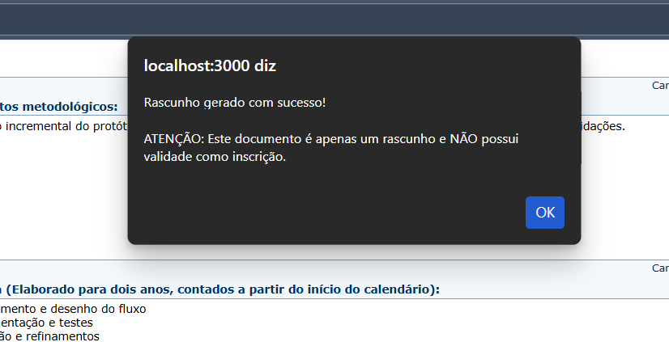
2. Confirme se o arquivo foi baixado e abra o PDF para revisar.
    

> Observação: o rascunho não gera protocolo/hash do servidor (não tem validade de envio).

### 4.6. Enviar inscrição e gerar PDF oficial

1. Clique em **Enviar Inscrição e Gerar PDF**.
    
2. No modal de confirmação, clique em **Confirmar Envio**.
    
3. Aguarde o sistema registrar a inscrição (o botão pode indicar “Registrando...” e depois “Gerando...”).
    
4. Baixe/abra o PDF gerado e confirme a presença de **Protocolo** e **Hash (SHA-256)**.
    

### 4.7. Como verificar a autenticidade (protocolo/hash)

Em geral, basta **guardar o seu PDF** com Protocolo e Hash. Caso a coordenação solicite uma verificação, siga as orientações abaixo.

1. Localize o **Protocolo** no seu PDF.
    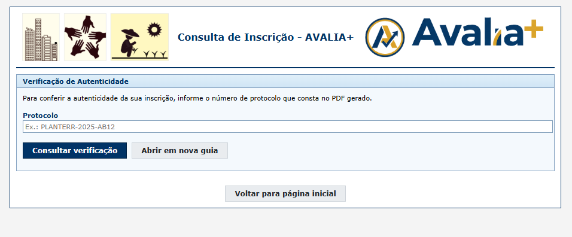
2. No navegador, acesse: `/api/verify/SEU_PROTOCOLO` (no mesmo domínio do sistema).
    
3. Verifique se o campo `valid` está como `true`.
    

---

## PARTE 2 — ÁREA RESTRITA (EQUIPE)

Esta parte é para quem trabalha na equipe do processo seletivo: **Administrador Geral**, **Presidente da Banca** e **Avaliadores**.

> Se você não recebeu usuário/senha e link de acesso, solicite à coordenação.

## 5. Administrador Geral: login e painel de inscrições

### 5.1. Fazer login (Admin)

1. Acesse a URL de login administrativa fornecida pela coordenação.
    
2. Digite usuário e senha do Admin.
    
3. Clique em **Entrar**.
    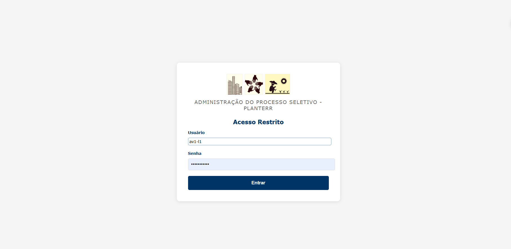

### 5.2. Entender o Dashboard do Admin

1. Confira a tabela de inscrições (colunas: data, protocolo, status, etc.).
    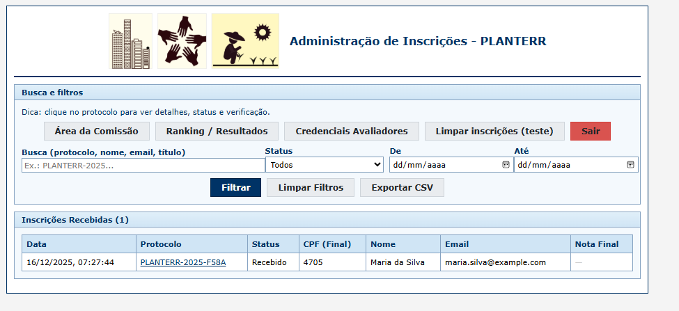
2. Identifique os atalhos principais (Área da Comissão, Ranking/Resultados, Credenciais Avaliadores, Sair).
    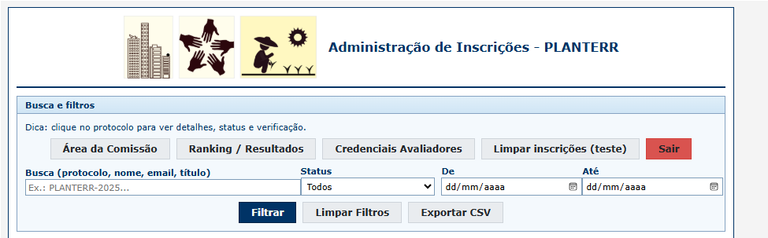

### 5.3. Buscar e filtrar inscrições

1. No campo de busca, digite protocolo, nome, e-mail ou título.
    
2. Selecione um status (ou “Todos”).
    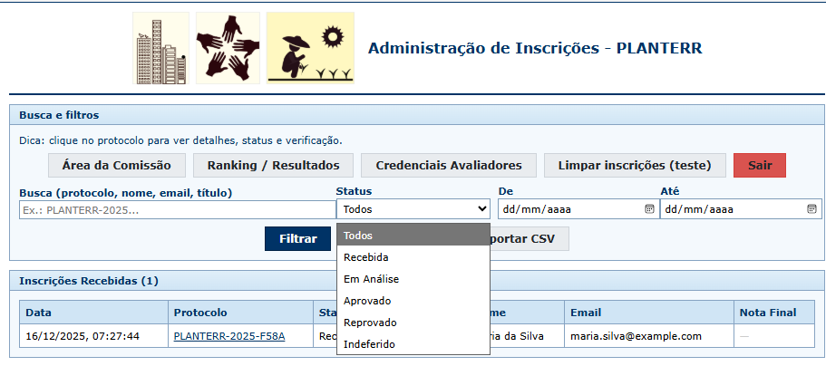
3. (Opcional) Defina período “De/Até”.
    
4. Clique em **Filtrar**.
    

### 5.4. Abrir detalhes de uma inscrição

1. Clique no **protocolo** da inscrição na tabela.
    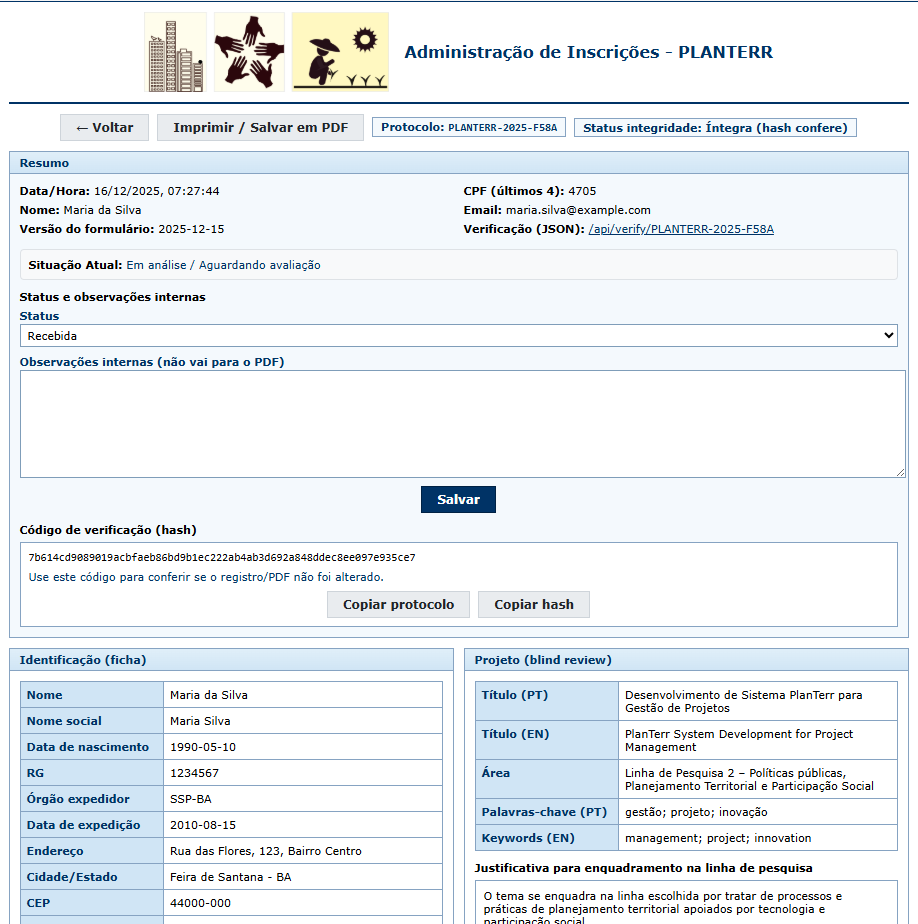
2. Na tela de detalhes, verifique:
    - Dados do candidato (quando identificado);
    - Dados do projeto;
    - Hash/protocolo;
    - Link de verificação (JSON).
    

### 5.5. Exportar CSV das inscrições

1. Aplique filtros (se necessário).
    
2. Clique em **Baixar CSV**.
    
3. Abra o CSV no Excel/LibreOffice.
    

### 5.6. Gerenciar credenciais de avaliadores

1. Clique em **Credenciais Avaliadores**.
    
2. Localize o avaliador desejado.
    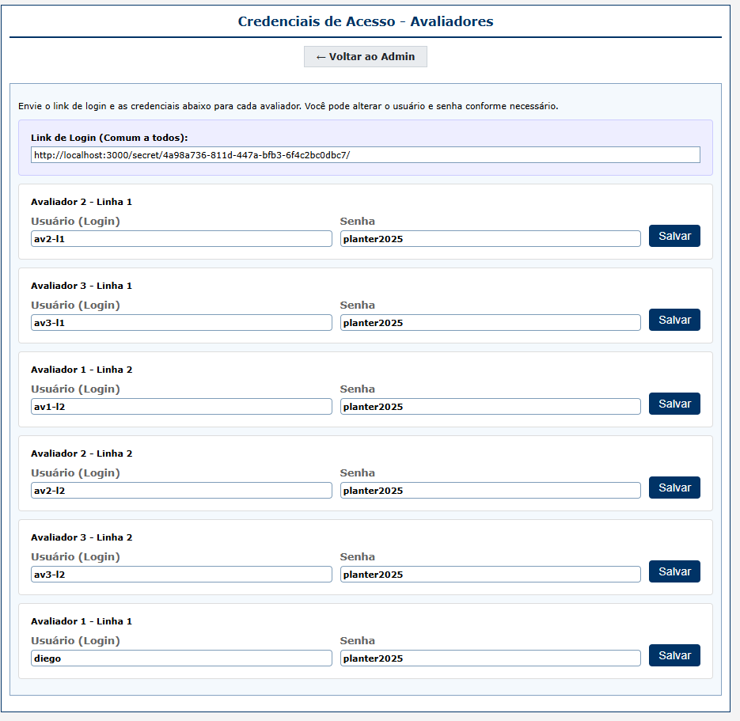
3. Atualize login/senha conforme necessário e salve.
    

### 5.7. Sair (logout)

1. Clique em **Sair**.
    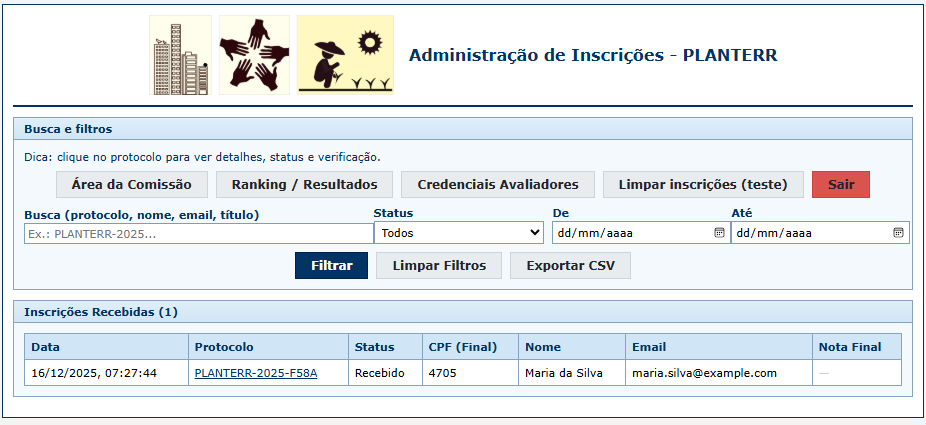
2. Confirme que voltou para a tela de login.
    

---

## 6. Presidente da Banca: Comissão e Resultados

## 6. Presidente da Banca: Área da Comissão e consolidação

> Este perfil normalmente acessa com credenciais de Admin, mas suas tarefas são focadas em consolidar avaliações e emitir resultados.

### 6.1. Acessar “Área da Comissão”

1. No Dashboard do Admin, clique em **Área da Comissão**.
    
2. Verifique a lista de projetos disponíveis para consolidação.
    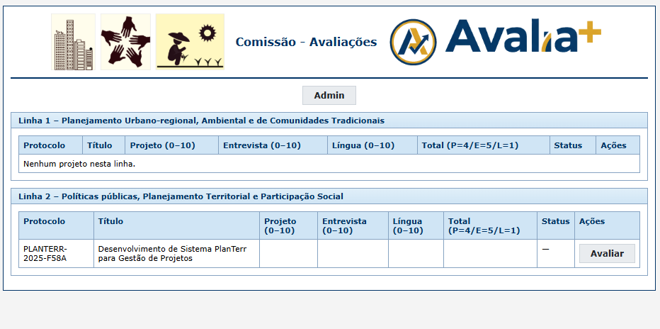

### 6.2. Consolidar notas (Projeto, Entrevista e Língua)

Nesta tela existem blocos para **Avaliador 1**, **Avaliador 2** e **Comissão**.

1. Clique em **Avaliar** no protocolo desejado.
    
2. Preencha as notas do critério **Projeto** para cada avaliador.
    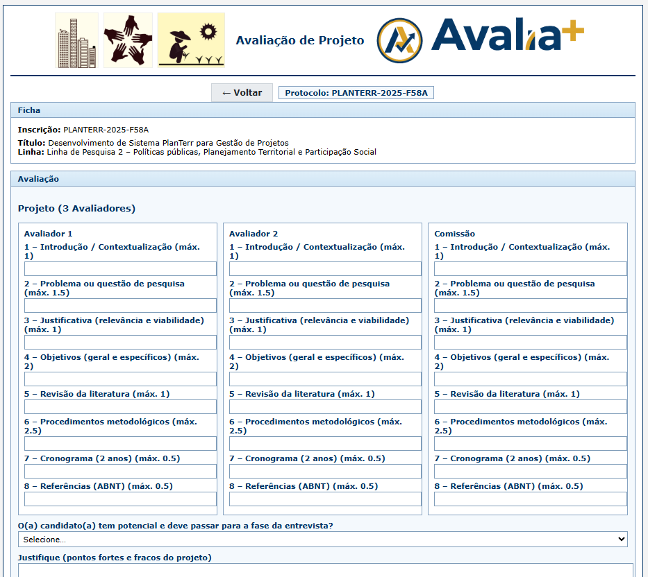
3. Preencha as notas do critério **Entrevista**.
    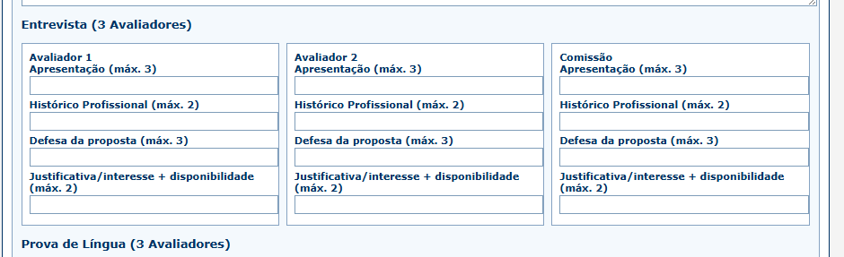
4. Preencha as notas do critério **Prova de Língua**.
    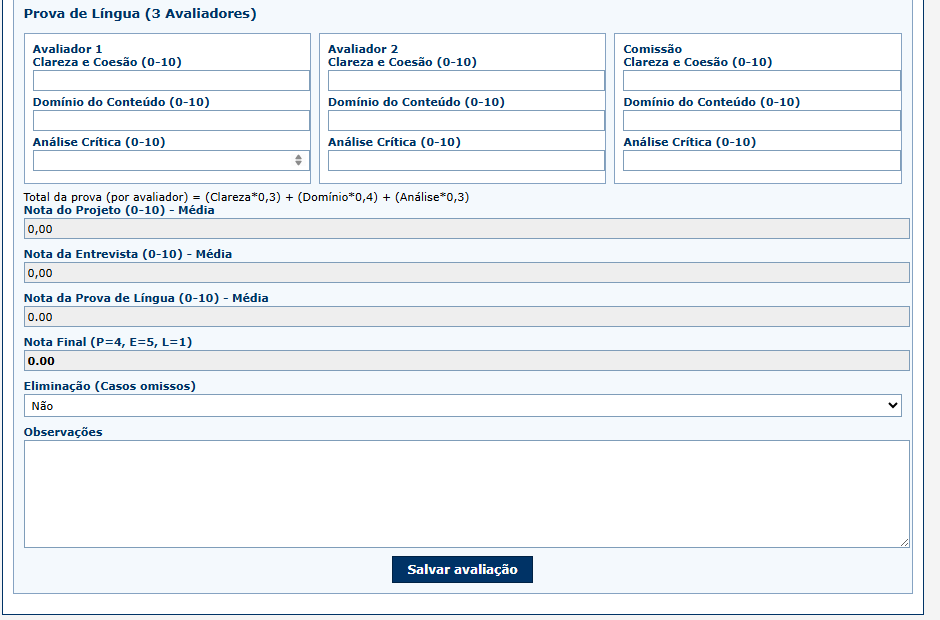
5. Confira os campos calculados automaticamente:
    - Nota do Projeto (média)
    - Nota da Entrevista (média)
    - Nota da Língua (média)
    - Nota Final (P=4, E=5, L=1)
    
6. (Opcional) Marque **Eliminação (Casos omissos)** e preencha **Observações**.
    
7. Clique em **Salvar avaliação**.
    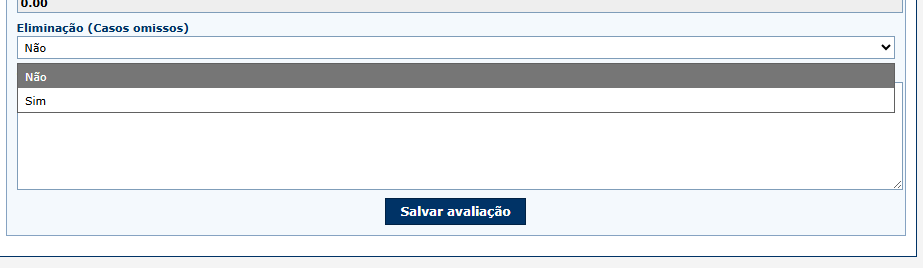

### 6.3. Acessar Ranking / Resultados

1. No Dashboard do Admin, clique em **Ranking / Resultados**.
    
2. Visualize as tabelas por linha de pesquisa.
    
3. Para exportar, clique em **Baixar CSV**.
    
4. Para gerar PDF/impressão, clique em **Imprimir / PDF**.
    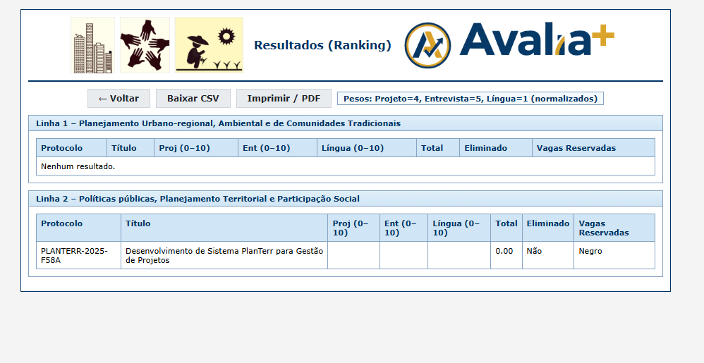

---

## 7. Avaliador: acessar área e registrar notas

O avaliador acessa uma área específica (definida por **linha** e **número do avaliador**).

### 7.1. Fazer login como avaliador

1. Acesse a tela de login (fornecida pela coordenação).
    
2. Digite o usuário e senha do avaliador.
    
3. Clique em **Entrar**.
    
4. Confirme que você foi redirecionado para a lista de projetos do avaliador.
    

### 7.2. Abrir um projeto para avaliação

1. Localize o protocolo desejado.
    
2. Clique em **Avaliar**.
    

### 7.3. Preencher e salvar a avaliação

1. Preencha as notas do **Projeto** (subitens) referentes ao seu perfil de avaliador.
    
2. Preencha as notas da **Entrevista**.
    
3. Preencha as notas da **Língua**.
    
4. Clique em **Salvar avaliação**.
    
5. Confirme o retorno para a lista e repita para os demais protocolos.
    

---

## PARTE 3 — DÚVIDAS E SUPORTE

## 8. Perguntas frequentes

**P (Candidato): consigo enviar mais de uma inscrição com o mesmo CPF?**  
**R:** Não. O servidor bloqueia duplicidade por CPF. Se precisar corrigir algo, entre em contato com a coordenação antes de um novo envio.

**P (Candidato): o que é Protocolo e Hash?**  
**R:** O Protocolo identifica sua inscrição. O Hash é um código verificável (SHA-256) que permite conferir integridade (se o conteúdo registrado corresponde ao que foi enviado).

**P (Admin): como exporto a lista filtrada?**  
**R:** Aplique os filtros e clique em **Baixar CSV**. O arquivo exporta apenas o que está dentro do filtro.

**P (Presidente): por que existem 3 colunas (Avaliador 1, Avaliador 2 e Comissão)?**  
**R:** A tela da Comissão consolida e calcula as médias considerando três “fontes” de avaliação. Isso padroniza o resultado final e permite relatórios.

**P (Avaliador): posso alterar uma avaliação depois de salvar?**  
**R:** Sim. Abra novamente o protocolo em **Avaliar**, ajuste as notas e salve.

## 9. Problemas comuns

### 9.1. “CPF inválido”

- Confira se digitou todos os números.
- Se estiver copiando/colando, apague e digite novamente.
- Se o erro persistir, teste em outro navegador.

### 9.2. “Obrigatório marcar a declaração para gerar o PDF”

- Volte até o final do formulário e marque o **Termo de Compromisso**.

### 9.3. “Foi detectado possível dado pessoal no projeto”

- Remova do texto do projeto qualquer **CPF, e-mail, telefone** ou identificação pessoal.
- Tente novamente após revisar o conteúdo.

### 9.4. Não consigo acessar a área restrita

- Confirme se você está usando o **link correto** (fornecido pela coordenação).
- Verifique usuário e senha.
- Se esqueceu a senha, peça ao Administrador para redefinir.

## 10. Contato e suporte

Se você encontrar erro que impede o uso do sistema, informe à coordenação:

- Seu perfil (Candidato/Admin/Presidente/Avaliador)
- O que você estava tentando fazer
- Uma captura de tela do erro (se possível)

