**Versão:** 1.0  
**Atualizado em:** 15/12/2025

---

## 1. APRESENTAÇÃO

Este manual explica, em linguagem simples, como o candidato realiza a inscrição no Sistema AVALIA+. Ao final do processo, o sistema gera um PDF oficial contendo o número de protocolo da inscrição e um código hash SHA-256 para verificação de autenticidade.

## 2. ANTES DE COMEÇAR

### 2.1. O que você precisa

Para realizar sua inscrição, você precisará de um computador ou celular com acesso à internet e um navegador atualizado como Chrome, Edge ou Firefox. Reserve um tempo adequado para preencher o formulário com calma e atenção.

### 2.2. Importante sobre avaliação às cegas

O anteprojeto é avaliado sem identificação dos candidatos. Por isso, não escreva CPF, e-mail, telefone ou qualquer dado pessoal no texto do projeto. Se o sistema detectar algum dado pessoal, ele impedirá o envio da inscrição.

## 3. COMO ACESSAR O FORMULÁRIO

Para iniciar sua inscrição, abra seu navegador de internet preferido e digite ou cole o link do formulário fornecido pela coordenação do programa. Aguarde o carregamento completo da página antes de começar a preencher. Quando o formulário estiver carregado, você verá a página inicial com o título do sistema e as seções que deverão ser preenchidas, conforme ilustrado abaixo.

**Figura 03** — Página inicial do formulário: título e primeira seção

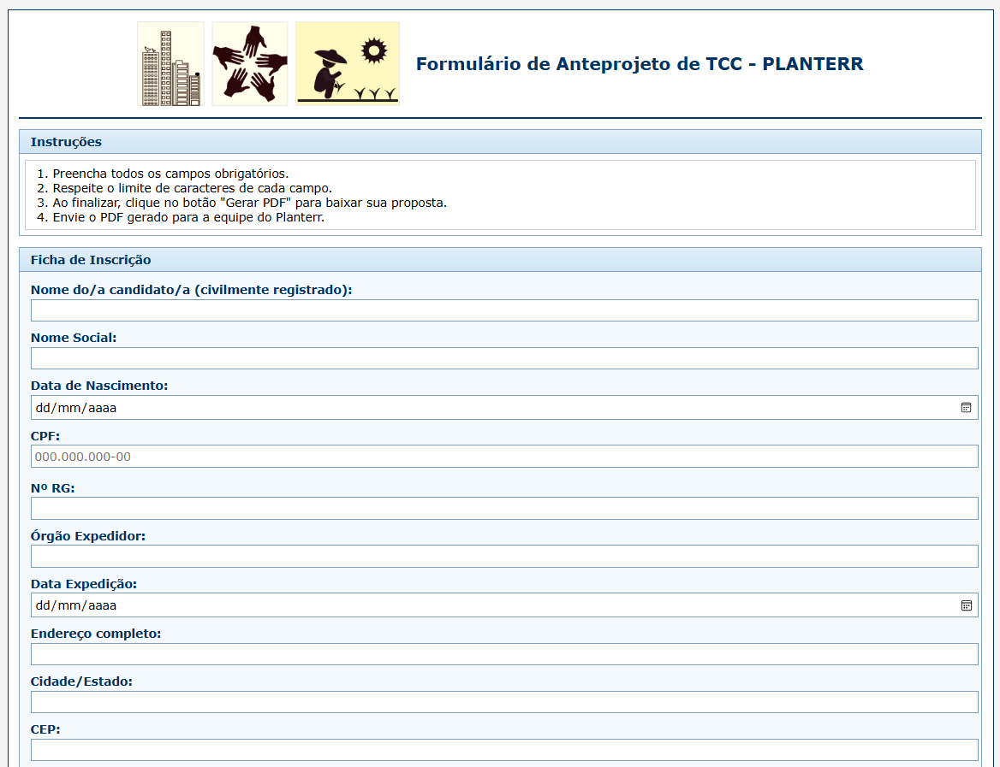{width=75%}

## 4. PREENCHENDO A INSCRIÇÃO

### 4.1. Ficha de Inscrição

A primeira seção do formulário é a Ficha de Inscrição, onde você fornece seus dados pessoais. É importante preencher todos os campos com atenção para evitar problemas no cadastro. Digite seu nome completo exatamente como consta nos documentos oficiais e informe seu CPF usando apenas números, sem pontos ou traços. Preencha também um e-mail válido que você acessa regularmente, pois será usado para comunicações sobre o processo. Complete os demais campos solicitados e observe se não aparecem mensagens de erro em vermelho abaixo de cada campo.

A figura abaixo mostra os principais campos da Ficha de Inscrição.

**Figura 05** — "Ficha de Inscrição": campos de Nome e CPF

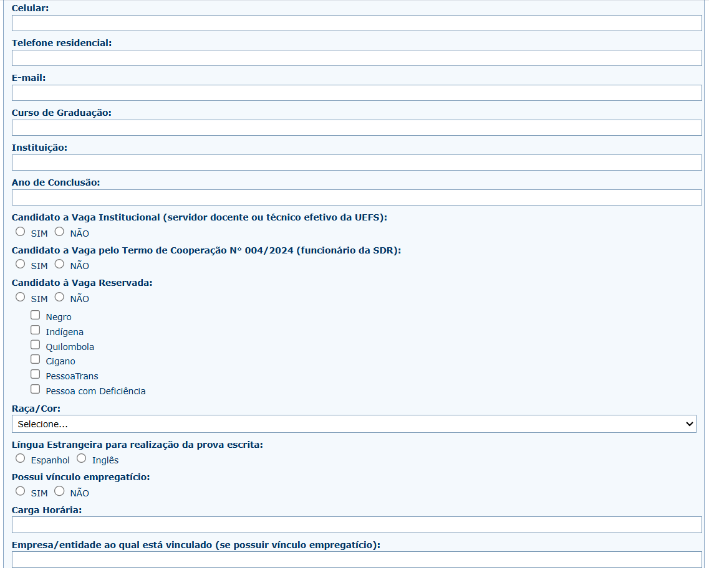{width=75%}

O sistema valida automaticamente se o CPF digitado é válido. Se aparecer a mensagem "CPF inválido" em vermelho, verifique se digitou todos os 11 números corretamente e se não há espaços antes ou depois. Evite usar copiar e colar, e se necessário, apague completamente o campo e digite novamente. A figura abaixo mostra um exemplo de como o sistema indica quando o CPF está inválido.

**Figura 06** — Exemplo de validação: mensagem "CPF inválido"

{width=75%}

### 4.2. Termo de Compromisso

Ao final da Ficha de Inscrição, há um Termo de Compromisso que você deve ler e aceitar antes de prosseguir. Este termo contém declarações importantes sobre a veracidade das informações e o compromisso com as regras do processo seletivo. Leia atentamente todo o texto e, se concordar, marque a caixa de seleção ao lado da declaração. Este campo é obrigatório e sem marcá-lo você não conseguirá enviar a inscrição. A figura abaixo mostra onde localizar e marcar este campo.

**Figura 07** — "Termo de Compromisso": caixa de seleção e aviso de obrigatoriedade.

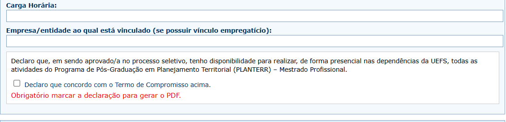{width=75%}

## 5. PREENCHENDO O PROJETO DE PESQUISA

### 5.1. Selecionar a área de pesquisa

Antes de descrever seu projeto, você precisa indicar em qual área ou linha de pesquisa ele se enquadra. Esta informação é fundamental para direcionar sua inscrição aos avaliadores corretos. Localize o campo de área no início da seção Projeto de Pesquisa, clique na lista suspensa para ver as opções disponíveis e escolha a área que melhor corresponde ao tema do seu projeto. Este campo é obrigatório e se não for selecionado, o sistema exibirá um alerta ao tentar enviar. A figura abaixo mostra como o campo de seleção aparece no formulário.

**Figura 08** — "Projeto de Pesquisa": seleção de "Área".

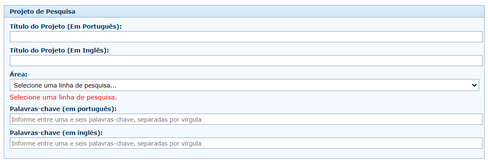{width=75%}

### 5.2. Limite de caracteres

Diversos campos do projeto possuem limites de caracteres para garantir que as informações sejam objetivas e dentro dos padrões do edital. Enquanto você digita, um contador dinâmico aparece abaixo do campo mostrando quantos caracteres ainda podem ser digitados. Quando o limite é atingido, o sistema impede a digitação de mais caracteres. Use o espaço com sabedoria sendo claro e objetivo na descrição. Se preferir, prepare seu texto previamente em um editor como Word ou Google Docs para revisar e ajustar o tamanho antes de colar no formulário. A figura abaixo ilustra como o contador de caracteres é exibido.

**Figura 09** — Campo "Resumo": contador de caracteres restantes.

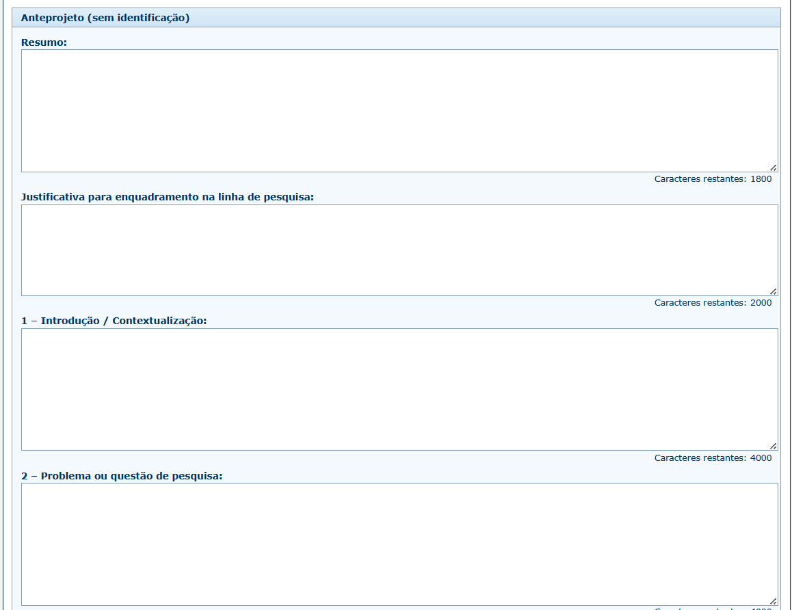{width=75%}

### 5.3. Evitar dados pessoais (regra da avaliação às cegas)

O Sistema PLANTERR utiliza o método de **avaliação às cegas** (blind review), onde os avaliadores não devem conhecer a identidade dos candidatos para garantir imparcialidade. Por isso, existem regras rígidas sobre o que pode ser escrito no texto do projeto.

**O que NUNCA deve aparecer no texto do projeto:**

- CPF, RG ou outros documentos
- Endereço de e-mail pessoal
- Número de telefone ou celular
- Nome completo do candidato
- Nome de orientadores (se houver)
- Instituições específicas que possam identificar você

**Importante:** Os dados pessoais devem estar APENAS na Ficha de Inscrição. O texto do projeto é anônimo.

A figura abaixo mostra um exemplo do que **NÃO** deve ser feito:

**Figura 10** — Exemplo (NÃO fazer): dado pessoal dentro do texto do projeto

{width=75%}

**O que acontece se você incluir dados pessoais?**

O sistema possui um detector automático que identifica possíveis dados pessoais no texto. Se algo for detectado:

- Um **alerta será exibido** antes do envio da inscrição.
- Você será **impedido de gerar o PDF** até corrigir o problema.
- Será necessário **revisar e remover** as informações identificadoras.

A figura abaixo mostra como o alerta é apresentado:

**Figura 11** — Alerta de "avaliação às cegas": possível dado pessoal detectado.

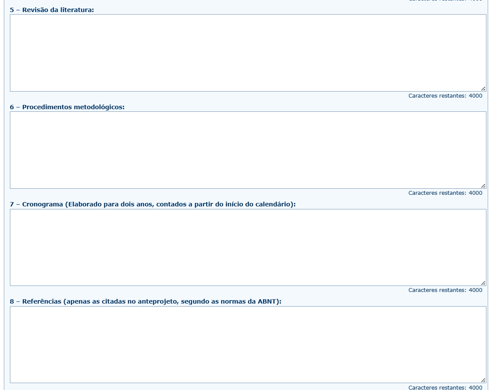{width=75%}

## 6. REVISAR ANTES DE ENVIAR

Antes de enviar definitivamente sua inscrição, é altamente recomendado gerar um rascunho para revisão. O rascunho permite que você visualize como as informações aparecerão no PDF final, sem efetuar o registro oficial. Após preencher todos os campos do formulário, role a página até o final e localize o botão "Baixar Rascunho (Não Envia)". Aguarde alguns segundos enquanto o PDF é gerado e o arquivo será baixado automaticamente para seu computador. Abra o arquivo PDF baixado e revise cuidadosamente todas as informações, verificando se não há erros de digitação e se todos os campos obrigatórios estão preenchidos. Se encontrar erros, volte ao formulário, corrija e gere um novo rascunho quantas vezes precisar. A figura abaixo mostra a localização do botão.

**Figura 12** — Botão "Baixar Rascunho (Não Envia)"

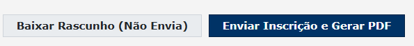{width=75%}

A figura abaixo mostra um exemplo do rascunho em PDF.

**Figura 13** — Rascunho em PDF (Não Envia)

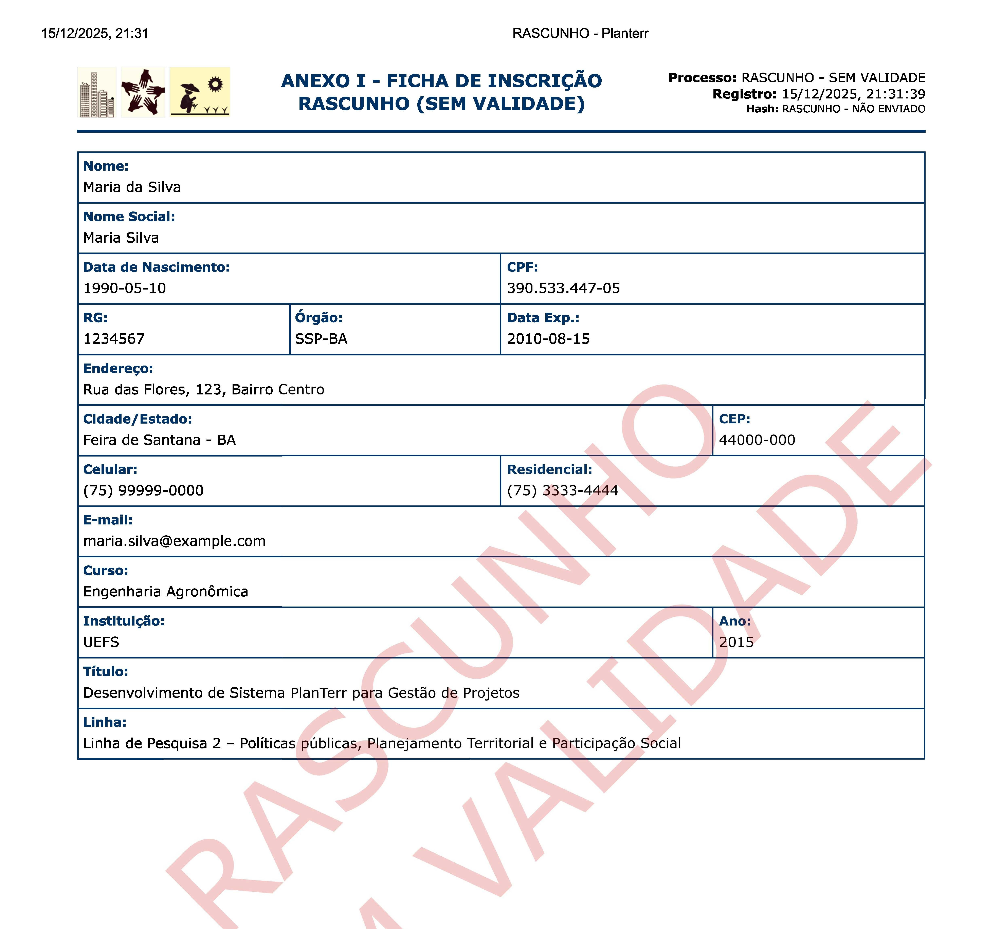{width=75%}

Lembre-se que o rascunho não registra sua inscrição no sistema, não contém número de protocolo oficial e não possui hash de verificação. Para efetivar a inscrição, você deve usar o botão "Enviar Inscrição e Gerar PDF" descrito na próxima seção.

## 7. ENVIAR INSCRIÇÃO E GERAR O PDF OFICIAL

Depois de revisar o rascunho e confirmar que todas as informações estão corretas, localize no final do formulário o botão "Enviar Inscrição e Gerar PDF" e clique nele.

**Figura 14** — Botão "Enviar Inscrição e Gerar PDF"

{width=75%}

Uma janela de confirmação aparecerá na tela. Leia atentamente a mensagem e clique em "Confirmar Envio" para registrar definitivamente a inscrição.

**Figura 15** — Modal de confirmação: "Confirmar Envio" e "Voltar e Revisar"

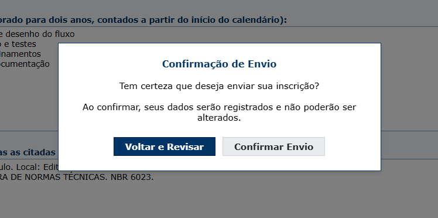{width=75%}

Aguarde o processamento sem fechar o navegador. Você verá mensagens como "Registrando..." e "Gerando..." enquanto o sistema salva seus dados e cria o PDF oficial. Este processo geralmente leva de 5 a 15 segundos. Quando terminar, o arquivo PDF será baixado automaticamente. Abra o arquivo imediatamente e confirme a presença do número de protocolo e do hash SHA-256, que são a comprovação de que sua inscrição foi registrada com sucesso.

**Figura 17** — PDF oficial gerado: Protocolo e Hash (SHA-256)

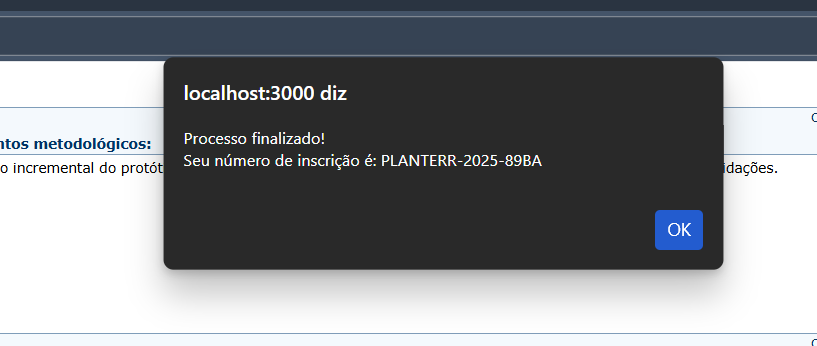{width=75%}

## 8. GUARDAR E VERIFICAR A INSCRIÇÃO

Guarde o PDF oficial gerado e anote o número do protocolo em local seguro. Se a coordenação solicitar, é possível verificar a autenticidade da inscrição pelo protocolo. Encontre o número do protocolo no PDF conforme mostrado abaixo.

**Figura 18** — PDF: Protocolo destacado

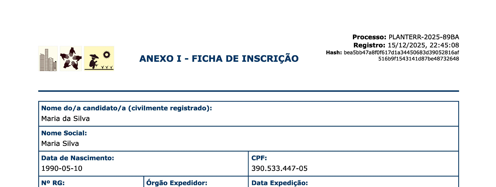{width=75%}

Para verificar, abra o navegador e acesse a página de verificação no mesmo domínio do sistema de inscrição.

**Figura 19** — Página de Verificação do Protocolo"

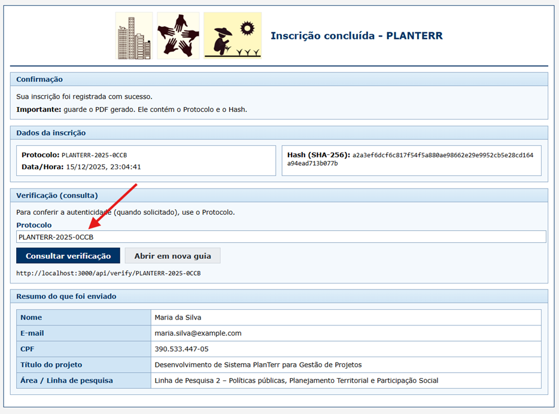{width=75%}

Se a inscrição estiver correta, aparecerá a inscrição foi encontrada e é autentica.

**Figura 20** — Verificação do Protocolo: resultado

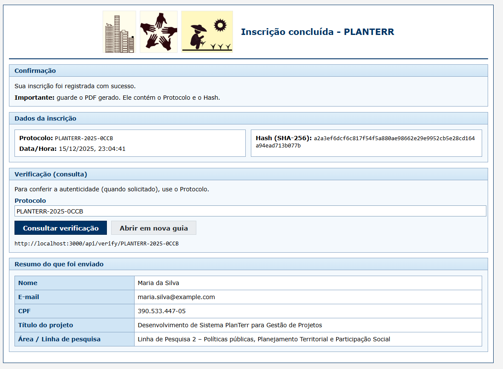{width=75%}

## 9. DÚVIDAS FREQUENTES

Se não conseguir gerar o PDF, verifique se o CPF é válido, se marcou o termo de compromisso e se não há alertas de avaliação às cegas indicando dados pessoais no texto. Não é possível enviar duas inscrições com o mesmo CPF, pois o sistema bloqueia duplicidade.

## 10. SUPORTE

Em caso de erro que impeça o envio da inscrição, informe à coordenação seu nome completo e descreva o que aconteceu. Se possível, envie uma captura de tela mostrando o erro.
