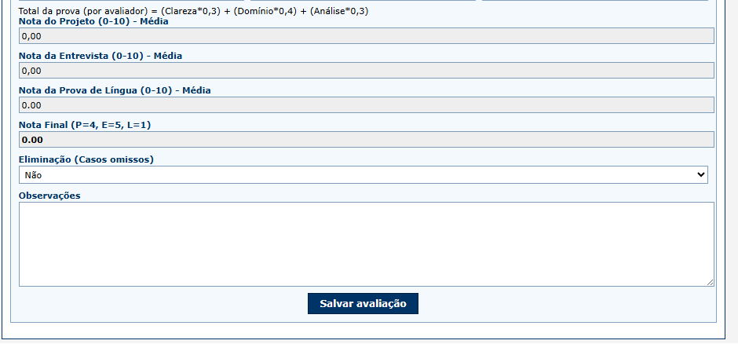
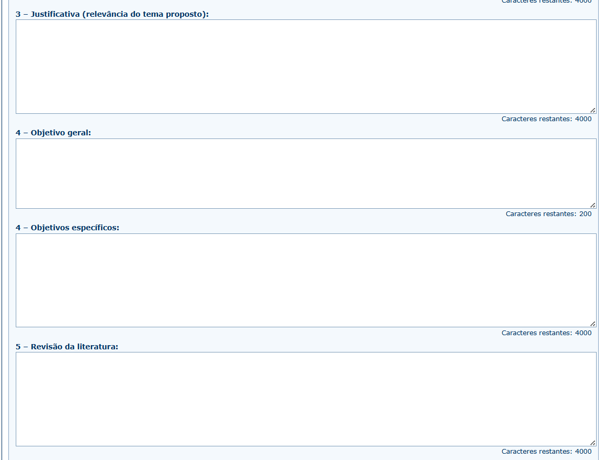

# Avalia+Tec

  

Pitch Deck para submissão na Fase 1 de Ideias Inovadoras do Programa Centelha 3 Bahia.

  Equipe Avalia+ • jan 2026

---
layout: default
---

# A Solução Definitiva para Governança em Seleções

  

    
    

      Transformamos processos seletivos vulneráveis em fluxos auditáveis, seguros e 100% digitais.
    

  

  

    Plataforma SaaS para:
    <ul class="mt-4 space-y-2">
      <li>📝 <b>Inscrição</b></li>
      <li>⚖️ <b>Avaliação Multicritério</b></li>
      <li>🔒 <b>Consolidação Auditável</b></li>
    </ul>
    

      Com integridade jurídica garantida.
    

  

---

# O Problema: O Caos da Gestão Manual

Processos seletivos geridos por e-mail e planilhas são uma **bomba-relógio jurídica e operacional**.

  

    <h3 class="text-red-800 font-bold">⚠️ Risco Jurídico Imediato</h3>
    
Falta de rastreabilidade abre margem para recursos e anulação de editais.

  

  

    <h3 class="text-orange-800 font-bold">📉 Ineficiência Operacional</h3>
    
Horas perdidas consolidando versões conflitantes de planilhas.

  

  

    <h3 class="text-blue-800 font-bold">🔓 Vulnerabilidade LGPD</h3>
    
Dados sensíveis de candidatos circulando sem controle em caixas de e-mail.

  

---
layout: default
---

# Evidências

  <!-- Coluna 1 -->
  

    

      
Fonte

      
Migalhas (2024)

      
      

        <a class="case-open" href="https://www.migalhas.com.br/depeso/415405/tudo-sobre-recursos-em-concursos-publicos" target="_blank">Abrir ↗</a>
      

    

    
    

      
Fonte

      
O Globo (2014)

      
      

        <a class="case-open" href="https://oglobo.globo.com/economia/emprego/concursos-os-principais-erros-cometidos-pelas-bancas-12627033" target="_blank">Abrir ↗</a>
      

    

  

  <!-- Coluna 2 -->
  

    

      
Fonte

      
ConJur (2025)

      
      

        <a class="case-open" href="https://www.conjur.com.br/2025-abr-09/da-interferencia-do-judiciario-em-concursos-publicos/" target="_blank">Abrir ↗</a>
      

    

    

      
Fonte

      
Teste do Congresso

      
      

        <a class="case-open" href="https://www2.testedocongresso.com.br/noticia/67895/aumentam-acoes-contra-concursos-na-justica" target="_blank">Abrir ↗</a>
      

    

  

---

# A Solução: Centralização com Rastreabilidade

Um ambiente único que garante **governança** do início ao fim.

  

    

      
🔄

      
<b>Fluxo End-to-End</b> Inscrição → Avaliação → Resultado

    

    

      
👁️

      
<b>Transparência Total</b> Candidato acompanha cada etapa

    

    

      
⚡

      
<b>Eficiência</b> Zero retrabalho manual

    

  

  

    
  

---

# Diferencial: Blindagem Jurídica

Não é apenas software, é **segurança jurídica** via tecnologia.

  

    <ul class="space-y-4">
      <li>
        <b>🔐 Prova de Integridade (Hash SHA-256)</b>
        
Cada documento recebe um selo criptográfico imutável. Garantia matemática de autoria.

      </li>
      <li>
        <b>🔎 Auditoria Instantânea</b>
        
Em caso de recurso, a prova técnica está pronta em segundos.

      </li>
      <li>
        <b>✅ Fim das Disputas</b>
        
Elimina dúvidas sobre "qual versão vale".

      </li>
    </ul>
  

  

    
  

---

# Privacidade e Compliance (LGPD)

Proteção de dados como **vantagem competitiva**, não apenas obrigação.

  

  

    
🙈

    <h3 class="font-bold text-sm">Blind Review Real</h3>
    
Avaliadores não veem quem é o candidato

  

  

    
🔑

    <h3 class="font-bold text-sm">Anonimização HMAC</h3>
    
Validação de CPF sem expor o dado

  

  

    
🛡️

    <h3 class="font-bold text-sm">Security by Design</h3>
    
Minimização desde a arquitetura

  

---

# Mercado: Busca por Conformidade

Um oceano azul em meio a ferramentas genéricas de eventos.

  

    
TAM

    <h2 class="text-3xl font-bold text-blue-900">R$ 14,6 Bi</h2>
    
Orçamento MCTI 2024

  

  

    
SAM (Foco)

    <h2 class="text-xl font-bold text-green-900">+200 Inst.</h2>
    
Fundações de Apoio & Instituições Federais

  

  

    
SOM

    <h2 class="text-xl font-bold text-gray-900">5 → 50</h2>
    
Instituições em 2 anos

  

---

# Por que o Avalia+Tec?

Ferramentas de **eventos** não entregam **segurança jurídica**.

<table class="w-full text-sm border-collapse">
  <thead>
    <tr class="bg-gray-100 text-gray-700">
      <th class="p-3 text-left">Característica</th>
      <th class="p-3 text-center">Even3 / Doity</th>
      <th class="p-3 text-center">Google Forms</th>
      <th class="p-3 text-center bg-blue-100 text-blue-900 border-b-2 border-blue-500">Avalia+Tec</th>
    </tr>
  </thead>
  <tbody>
    <tr class="border-b border-gray-100">
      <td class="p-3 font-semibold">Foco Principal</td>
      <td class="p-3 text-center text-gray-500">Congressos</td>
      <td class="p-3 text-center text-gray-500">Pesquisas</td>
      <td class="p-3 text-center font-bold text-blue-900 bg-blue-50">Seleções/Editais</td>
    </tr>
    <tr class="border-b border-gray-100">
      <td class="p-3 font-semibold">Gestão de Banca</td>
      <td class="p-3 text-center text-gray-500">Foco Acadêmico</td>
      <td class="p-3 text-center text-gray-500">Manual</td>
      <td class="p-3 text-center font-bold text-blue-900 bg-blue-50">Auditável</td>
    </tr>
    <tr class="border-b border-gray-100">
      <td class="p-3 font-semibold">Integridade</td>
      <td class="p-3 text-center text-gray-500">Nenhuma</td>
      <td class="p-3 text-center text-gray-500">Nenhuma</td>
      <td class="p-3 text-center font-bold text-blue-900 bg-blue-50">Hash SHA-256</td>
    </tr>
    <tr class="border-b border-gray-100">
      <td class="p-3 font-semibold">Risco Jurídico</td>
      <td class="p-3 text-center text-orange-500">Médio</td>
      <td class="p-3 text-center text-red-500">Alto</td>
      <td class="p-3 text-center font-bold text-green-700 bg-blue-50">Blindado</td>
    </tr>
  </tbody>
</table>

---

# Modelo de Negócio

SaaS B2B flexível para a realidade dos editais.

  

    
🎫

    <h3 class="font-bold text-lg mb-2">Licença por Edital</h3>
    
Para demandas pontuais

    
R$ 4,5k avg

  

  

    
📅

    <h3 class="font-bold text-lg mb-2">Assinatura Anual</h3>
    
Instituições recorrentes

    
R$ 30k/ano

  

  

    
🛠️

    <h3 class="font-bold text-lg mb-2">Setup + Suporte</h3>
    
Consultoria inclusa

    
Incluso no plano

  

---

# Estágio Atual e Tração

**MVP Funcional e Validado.**

  

    

      

      Módulos de Inscrição e Avaliação operacionais.
    

    

      

      Sistema de Recursos e Resultados implementado.
    

    

      

      Arquitetura escalável (Node.js + Postgres).
    

    

      🚧 <b>Próximo passo:</b> Validação comercial com pilotos pagos.
    

  

  

    
  

---

# A Equipe

  

    
    
Diego

    
Produto & Negócios

  

  

    
    
Catuxe Varjão

    
Engenharia & Qualidade

  

  

    
    
Dulce Paloma

    
Jurídico & LGPD

  

  

    
    
Everaldo Fontes

    
Dev & UX

  

