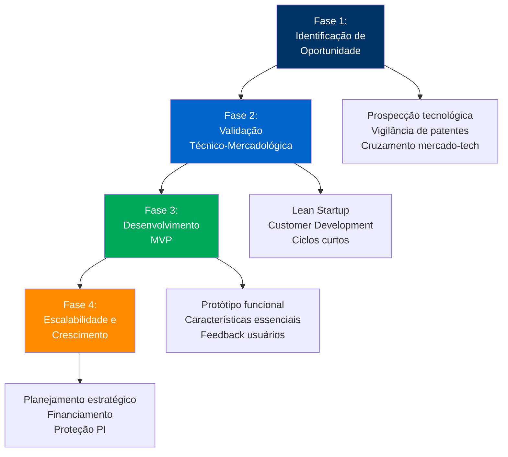
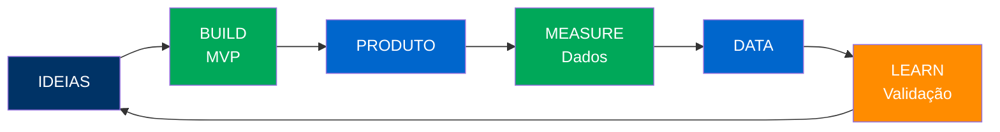
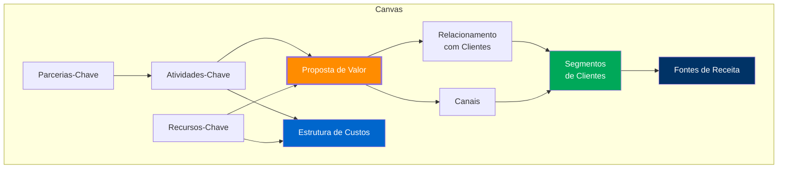
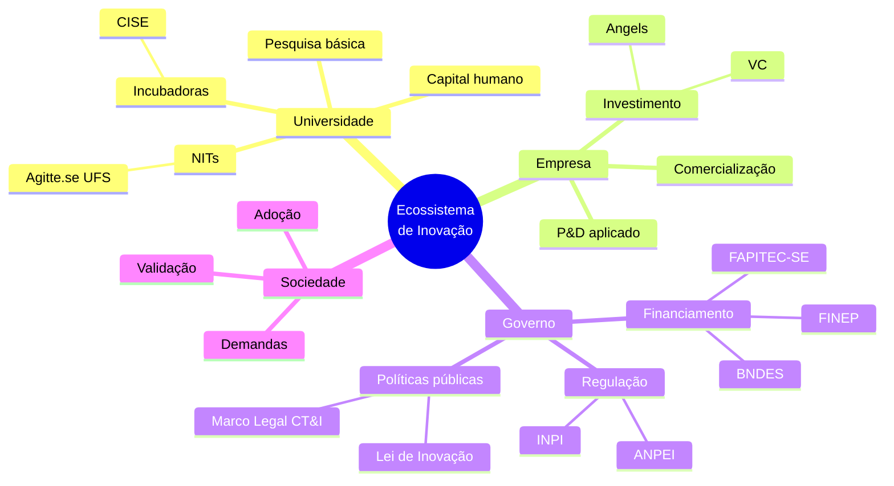
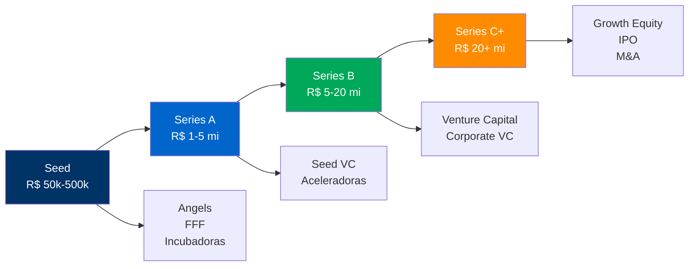
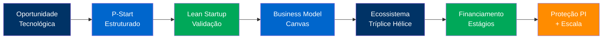

<!-- _class: lead -->

# Empreendedorismo Tecnológico

## Da Geração da Ideia à Criação de Startups

### Universidade Federal de Sergipe
**Concurso Público para Docente**

---

## 📋 Agenda da Aula

### Fundamentos (20 min)
1. Empreendedorismo tecnológico
2. Modelo P-Start
3. Lean Startup

### Aplicações (20 min)
4. Business Model Canvas
5. Ecossistemas de Inovação
6. Caso Sergipe/CISE

### Síntese (10 min)
7. Conclusões e perspectivas

---

## 💡 Questão Provocativa

**Por que 90% das startups fracassam nos primeiros 3 anos?**

📊 **Dados**: Falta de validação de mercado é a causa #1 de falha (CB Insights, 2023)

<!-- 
NOTAS DO APRESENTADOR:
- CB Insights: análise de 100+ post-mortems de startups
- 42% fracassam por falta de necessidade de mercado
- 29% por falta de recursos financeiros
- 23% por equipe inadequada
- Justifica necessidade de metodologias estruturadas
- Timing: 2 minutos
-->

---

## 🚀 Empreendedorismo Tradicional vs. Tecnológico

### Tradicional

**Base**
- Oportunidades de mercado existentes
- Modelos de negócio testados

**Recursos**
- Capital inicial moderado
- Conhecimento de gestão

**Risco**
- Mercadológico (demanda, concorrência)
- Operacional

**Crescimento**
- Incremental e local

### Tecnológico (Bailetti, 2012)

**Base**
- Resultados científicos
- Tecnologias emergentes

**Recursos**
- P&D intensiva
- Know-how especializado
- Proteção de PI

**Risco**
- **Radical** (técnico + mercado)
- Incerteza tecnológica

**Crescimento**
- Disruptivo e escalável globalmente

<!-- 
NOTAS:
- Bailetti, T. (2012). Technology Entrepreneurship
- Intensidade P&D: startups tech gastam 15-25% receita em P&D vs. 2-5% tradicionais
- Exemplo BR: Movile, 99, Nubank (unicórnios tecnológicos)
- Timing: 4 minutos
-->

---

## 📐 Modelo P-Start (Souza, 2022)

<!-- 
NOTAS:
- Souza, M. (2022). Modelo P-Start para startups tecnológicas
- Fase 1 reduz risco de soluções desconectadas da realidade
- Fase 2 usa metodologias ágeis (Lean, Design Thinking)
- Fase 3 privilegia MVP sobre produto completo
- Fase 4 exige instrumentos de financiamento (seed, venture capital)
- Timing: 5 minutos
-->

---

## 🔄 Lean Startup (Ries, 2011)

### Ciclo Build-Measure-Learn

"Minimizar tempo total através deste ciclo de feedback é essência do Lean Startup"

### Princípios Fundamentais

#### Empreendedores estão em toda parte
Não apenas garagens do Vale do Silício

#### Empreender é gerenciar
Requer estrutura e processo

#### Aprendizado validado
Testar hipóteses sistematicamente

<!-- 
NOTAS:
- Eric Ries, "The Lean Startup" (2011)
- Origem: Toyota Production System adaptado para startups
- MVP: versão mais simples para testar hipóteses
- Pivot vs. Persevere: mudar estratégia com base em dados
- Exemplos: Dropbox (vídeo como MVP), Zappos (fotos de sapatos)
- Timing: 5 minutos
-->

---

## 🎨 Business Model Canvas (Osterwalder, 2010)

### 9 Dimensões Fundamentais

**Lado Direito (Valor)**: Clientes, Proposta de Valor, Canais, Relacionamento, Receitas  
**Lado Esquerdo (Eficiência)**: Recursos, Atividades, Parcerias, Custos

<!-- 
NOTAS:
- Osterwalder & Pigneur, "Business Model Generation" (2010)
- Canvas permite visualização integrada do modelo de negócio
- Proposta de Valor no centro: o que resolve problema do cliente?
- Adaptável para contextos de economia solidária e desenvolvimento territorial
- Exemplo UFS: Spin-offs podem usar Canvas para estruturar modelo
- Timing: 5 minutos
-->

---

## 🔬 Transferência de Tecnologia

### Modalidades Estratégicas

#### 1. Licenciamento
- **Exclusivo**: Um único licenciado
- **Não-exclusivo**: Múltiplos licenciados
- **Territoriais**: Limitações geográficas

#### 2. Spin-offs
- Criação de nova empresa
- Transferência de tecnologia da universidade
- Participação acionária

#### 3. Joint Ventures
- Parceria estratégica
- Compartilhamento de riscos e benefícios
- Desenvolvimento conjunto

#### 4. Parcerias P&D
- Projetos colaborativos
- Proof of Concept
- Pesquisa aplicada

### Instrumentos Jurídicos

**NDA** (Non-Disclosure Agreement)
- Proteção de informações confidenciais
- Fase exploratória

**Contrato de Licenciamento**
- Cessão de direitos de uso
- Royalties e contrapartidas

**Termo de Cooperação Tecnológica**
- Desenvolvimento conjunto
- Repartição de PI gerada

### Decisão Multicritério (AHP)

**Critérios de Avaliação:**
- Retorno econômico
- Controle intelectual
- Complexidade implementação
- Alinhamento estratégico
- Risco envolvido

<!-- 
NOTAS:
- Bozeman, B. (2000). Technology Transfer and Public Policy
- Arora et al. (2001). Markets for Technology
- AHP (Analytic Hierarchy Process): método de tomada de decisão multicritério
- Brasil: Lei 10.973/2004 regula transferência universidade-empresa
- Timing: 5 minutos
-->

---

## 🌐 Ecossistemas de Inovação: Tríplice Hélice

<!-- 
NOTAS:
- Etzkowitz & Leydesdorff (2000). Triple Helix model
- Evolução: Tríplice → Quádrupla (sociedade) → Quíntupla (meio ambiente)
- Governança, confiança mútua e compartilhamento de benefícios são essenciais
- Timing: 4 minutos
-->

---

## 🏢 Ecossistema Sergipano de Inovação

### CISE - Centro de Inovação UFS

📊 **Dados CISE (2024)**
- **23 startups** incubadas
- **R$ 4,5 milhões** captados
- **180 empregos** gerados
- **8 graduadas** (taxa sucesso 35%)

#### Programas de Apoio
- Pré-incubação (6 meses)
- Incubação (até 24 meses)
- Aceleração
- Mentoria especializada
- Conexão com investidores

#### Setores Atendidos
- TICs e Software
- Biotecnologia
- Energia renovável
- Agronegócio 4.0

### FAPITEC-SE

**Editais de Fomento 2024:**
- R$ 12 milhões em CT&I
- 150+ projetos aprovados
- Bolsas de inovação tecnológica
- Subvenção a empresas

### TechSE - Ecossistema Local

**Atores-Chave:**
- **UFS, IFS, UNIT**: Formação e pesquisa
- **CISE, Sergipetec**: Incubação
- **FAPITEC-SE**: Financiamento
- **SEDETEC**: Políticas públicas
- **Startups locais**: 60+ ativas

**Desafios:**
- Baixa densidade de capital de risco
- Êxodo de talentos
- Mercado local limitado

**Oportunidades:**
- Óleo & gás offshore
- Aquicultura marinha
- Energias renováveis
- Turismo tecnológico

<!-- 
NOTAS:
- CISE inaugurado em 2017, referência regional
- Taxa de sucesso de incubadoras BR: 25-40%
- Sergipe: 60+ startups ativas (2024), crescimento 20% a.a.
- Oportunidade: diversificação econômica além petróleo
- Timing: 5 minutos
-->

---

## 💰 Financiamento de Startups Tecnológicas

### Instrumentos Brasileiros

#### Públicos
- FINEP (Inovacred, Centelha)
- BNDES (Criatec, MPME)
- FAPITEC-SE (Subvenção)
- EMBRAPII

#### Privados
- Venture Capital (600+ fundos BR)
- Angels (15.000+ investidores)
- Corporate VC
- Crowdfunding equity

#### Alternativos
- Bootstrapping
- Revenue-based financing
- Venture debt
- Aceleradoras corporativas

<!-- 
NOTAS:
- FFF: Friends, Family, Fools
- Brasil investiu US$ 3,2 bi em VC (2023), -15% vs. 2021
- 47 unicórnios brasileiros (2024)
- Desafio: Vale da Morte (valley of death) entre seed e Series A
- Timing: 4 minutos
-->

---

## ⚖️ Propriedade Intelectual em Startups

### PI como Ativo Estratégico

#### Funções da PI

1. **Proteção**
	- Barreira à entrada
	- Exclusividade temporária

2. **Sinalização**
	- Credibilidade técnica
	- Atração de investidores

3. **Monetização**
	- Licenciamento
	- Venda de ativos

4. **Negociação**
	- Moeda de troca em parcerias
	- Valorização em M&A

### Armadilhas Comuns

❌ **Publicar antes de proteger**
- Perda de novidade
- Domínio público

❌ **Ignorar PI de terceiros**
- Freedom to Operate
- Risco de litígio

❌ **Co-criação sem acordo prévio**
- Titularidade indefinida
- Conflitos futuros

❌ **Não proteger software**
- Código-fonte exposto
- Engenharia reversa

**Boa Prática:** Fazer busca de anterioridade ANTES de iniciar desenvolvimento. Custo: R$ 500-2.000. Evita prejuízo de R$ 50.000+ em desenvolvimento de produto que infringe patente de terceiros.

<!-- 
NOTAS:
- Patente sinaliza qualidade técnica para investidores (efeito certificação)
- Startups com patentes captam 30-50% mais recursos (OCDE, 2021)
- Brasil: apenas 12% startups têm PI registrada (ABStartups, 2023)
- Cultura de "growth at all costs" vs. proteção adequada
- Timing: 4 minutos
-->

---

## 📊 Desafios e Oportunidades

### ⚠️ Desafios

1. **Validação de mercado**
	- Distância cliente-desenvolvedor
	- Viés de confirmação

2. **Equipe inadequada**
	- Desequilíbrio técnico-negócio
	- Conflitos societários

3. **Recursos limitados**
	- Runway curto
	- Queima de caixa elevada

4. **Escala prematura**
	- Growth antes de product-market fit
	- Desperdício de capital

5. **Regulação**
	- Complexidade tributária
	- Barreiras setoriais

### 💡 Oportunidades Brasil

1. **Mercado doméstico**
	- 215 milhões de habitantes
	- Classe média crescente

2. **Talento técnico**
	- 1 milhão formandos STEM/ano
	- Custo competitivo vs. EUA/Europa

3. **Problemas locais**
	- Fintech (inclusão financeira)
	- Agro 4.0
	- Saúde digital

4. **政府 Políticas**
	- Lei do Bem (incentivos fiscais)
	- Marco Legal Startups (LC 182/2021)

5. **Internacionalização**
	- Software-as-a-Service global
	- Nearshoring LATAM

<!-- 
NOTAS:
- LC 182/2021: Lei Complementar das Startups (facilitação tributária, investimento)
- Brasil: 4º maior mercado de startups do mundo (2024)
- Oportunidade setorial: Fintechs (64% das startups BR), Healthtechs, Agritechs
- Timing: 4 minutos
-->

---

## 🎓 Síntese Conceitual

### 🔑 Mensagens-Chave

1. **Empreendedorismo tecnológico** exige metodologias estruturadas (P-Start, Lean) para reduzir riscos
2. **Validação de mercado** precede desenvolvimento completo do produto (MVP)
3. **Business Model Canvas** sistematiza lógica de criação e captura de valor
4. **Ecossistemas robustos** (Tríplice Hélice) aceleram crescimento de startups
5. **PI** não é luxo, mas necessidade estratégica para proteção e financiamento

<!-- 
NOTAS:
- Reforçar importância de processo estruturado vs. "apenas executar"
- Empreendedorismo tecnológico como motor de desenvolvimento regional
- Timing: 3 minutos
-->

---

<!-- _class: lead -->

# 💬 Questões para Reflexão

1. **Como universidades brasileiras podem fortalecer a cultura empreendedora sem comprometer excelência acadêmica?**

2. **Quais os principais gargalos para acesso a financiamento de startups tecnológicas no Nordeste?**

3. **De que forma a proteção de PI pode ser equilibrada com a necessidade de abertura e colaboração em ecossistemas de inovação?**

4. **Como o modelo de Tríplice Hélice pode ser adaptado para contextos de economia solidária e desenvolvimento territorial?**

---

<!-- _class: lead -->

# 📚 Referências Principais

**BAILETTI, T.** (2012). Technology Entrepreneurship: Overview, Definition, and Distinctive Aspects. Technology Innovation Management Review.

**BLANK, S.** (2013). The Four Steps to the Epiphany: Successful Strategies for Products that Win. K&S Ranch.

**ETZKOWITZ, H.; LEYDESDORFF, L.** (2000). The Dynamics of Innovation: From National Systems and "Mode 2" to a Triple Helix. Research Policy, 29(2), 109-123.

**OSTERWALDER, A.; PIGNEUR, Y.** (2010). Business Model Generation. Wiley.

**RIES, E.** (2011). The Lean Startup: How Today's Entrepreneurs Use Continuous Innovation to Create Radically Successful Businesses. Crown Business.

**SOUZA, M.** (2022). Modelo P-Start para Startups Tecnológicas: Framework Integrado. Revista Brasileira de Inovação.

**TIDD, J.; BESSANT, J.** (2005). Managing Innovation: Integrating Technological, Market and Organizational Change. Wiley.

---

<!-- _class: lead -->

# Obrigado pela Atenção! 🎓

## Perguntas?

**Prof. [Seu Nome]**  
📧 email@ufs.br  
🔗 lattes.cnpq.br/[seu-lattes]

**Universidade Federal de Sergipe**  
Concurso Público - Gestão da Inovação Tecnológica

